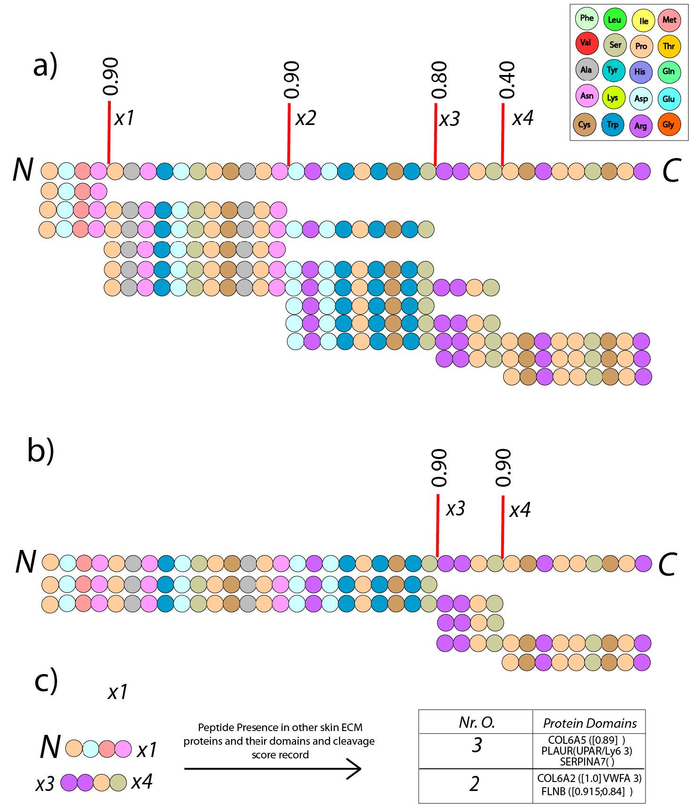

# Matrikine_Discovery Pipeline

  

This repo contains code that takes as an input protein domains information, cleavage site information, Uniprot data to combine and analyse the most potent matrikines. Code preforms peptide generation analysis based on Prosper outputs generated on stand by prosper run on Condor Manchester. The code also searches which other skin proteins according to MSP contain the particular peptide and in which domain. This is further used to derive 4mer and 5mer peptides used for testing in skin cosmetics by Sederma and WBA.

1) Manuscript has utilised prosper prediction depostited here:

Project contributors: Matiss Ozols, Nathan Jariwala, Alex Eckersley, Michael Sherratt

The files has been pre-prepeared. All the proteins reported in skin proteome n=2859 (https://www.manchesterproteome.manchester.ac.uk/#/Proteome ) were digested using Prosper algorythm - these results are commited in this repo: ./Recourses/Prosper.csv.gz

We also extracted all the protein domains available and their positions to analyse whether particular peptide will be present in any active protein domains (./Recourses/Domains_Info.csv.gz).